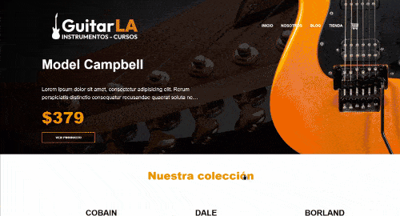

    

This a web site for the GitarLA a guitar store with blogs, courses and more!

You can see the live preview → [GuitarLA](https://guitarla-next-hernan1ro.vercel.app/).

<h2 id="scripts">🏁 Getting started</h2>
Download the project and then execute <strong>npm install</strong> <strong>npm run start</strong>
 
 

<h2 id="preview">🔍 Preview</h2>

  

 
 
<h2 id="technologies">📲 Technologies</h2>

1. React
2. Next.js
3. CSSModules
